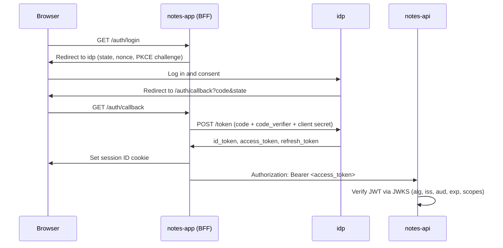

# oidc-lab

A hand-built OAuth 2.0 / OpenID Connect system: an identity provider, a client app, and a resource API, each implemented from scratch to understand token-based authentication end to end.

> **This is a learning project, not a product.** When there's a choice between a shortcut and seeing the mechanism, it picks the mechanism.

## Why

Session-cookie auth libraries (like Better Auth) work well, but they hide the model most other systems use: access and refresh tokens, JWT verification against a JWKS, PKCE, refresh token rotation, and SSO. Building every party in the flow makes each step, and each security check, visible.

The OAuth client is written by hand on purpose. No `openid-client`, Auth.js, or Passport; [`jose`](https://github.com/panva/jose) is the only helper.

## Architecture

pnpm monorepo, TypeScript throughout.

| App          | Stack                                                                 | URL                         | Role                                                              |
| ------------ | --------------------------------------------------------------------- | --------------------------- | ----------------------------------------------------------------- |
| `idp/`       | Express + [`oidc-provider`](https://github.com/panva/node-oidc-provider) | `http://idp.localhost:4000` | Identity provider: logs users in, issues tokens, serves the JWKS  |
| `notes-app/` | Next.js                                                               | `http://app.localhost:3000` | Client app (UI + BFF): runs the OAuth flow, holds tokens server-side |
| `notes-api/` | NestJS                                                                | `http://api.localhost:5000` | Resource server: notes CRUD, verifies JWT access tokens locally   |

The browser only ever holds a session ID cookie for `notes-app`. It never sees a token.



## Roadmap

- [x] **1. Bare IdP:** in-memory provider, one static client, a full flow driven by hand with `curl`
- [x] **2. Client auth by hand:** login, callback, logout, server-side sessions, `id_token` verification
- [x] **3. Resource API:** JWT access tokens, NestJS guard with JWKS, `aud`/`iss`/scope checks
- [ ] **4. Refresh tokens:** rotation, reuse detection, single-flight refresh per session
- [ ] **5. Real IdP:** own login and consent pages, Postgres + Prisma, argon2, Redis
- [ ] **6. SSO and logout:** a second client app, RP-initiated and back-channel logout
- [ ] **7. Stretch:** signing key rotation, DPoP sender-constrained tokens

## Getting started

**Prerequisites:** Node 24+ and pnpm via Corepack (`corepack enable`).

**Hostnames:** each app needs its own hostname, because cookies are scoped by host, not port. Add this to your hosts file:

```
127.0.0.1 idp.localhost app.localhost api.localhost
```

**Install and run:**

```bash
pnpm install
pnpm --filter idp dev        # http://idp.localhost:4000
pnpm --filter idp typecheck  # tsx doesn't type-check, tsc does
pnpm --filter notes-app dev  # http://app.localhost:3000 (setup: notes-app/README.md)
pnpm --filter notes-api start:dev  # http://api.localhost:5000
```

Then open the discovery document at `http://idp.localhost:4000/.well-known/openid-configuration`.

> ⚠️ The IdP currently runs with `oidc-provider`'s built-in development signing key. Its private half is public, so never trust tokens from this setup outside local development.
